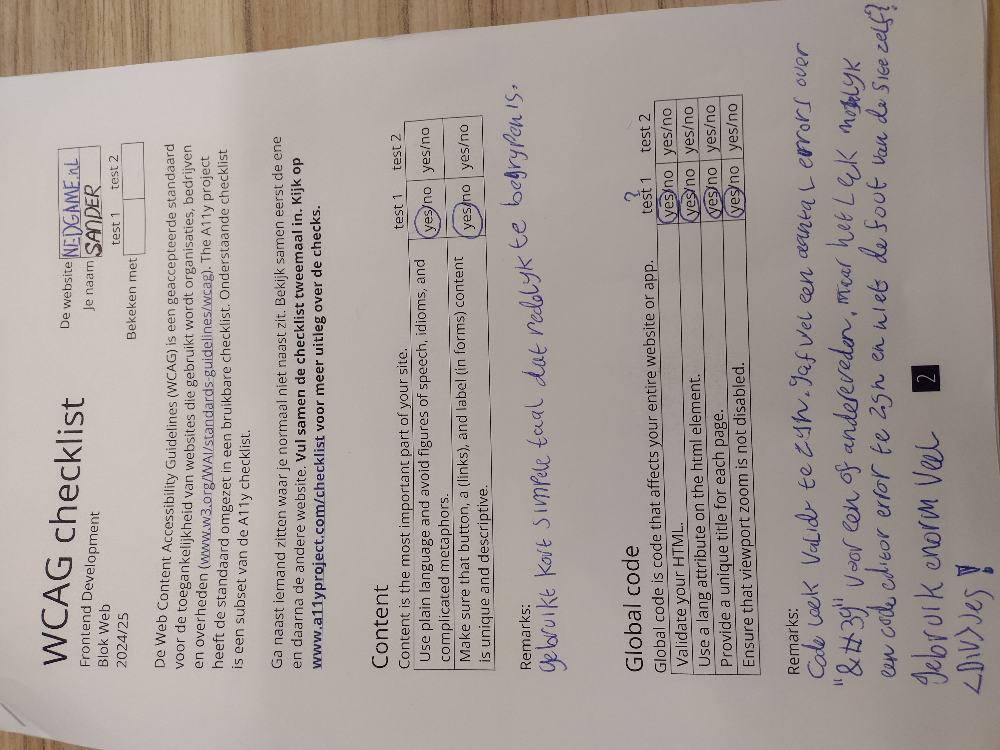
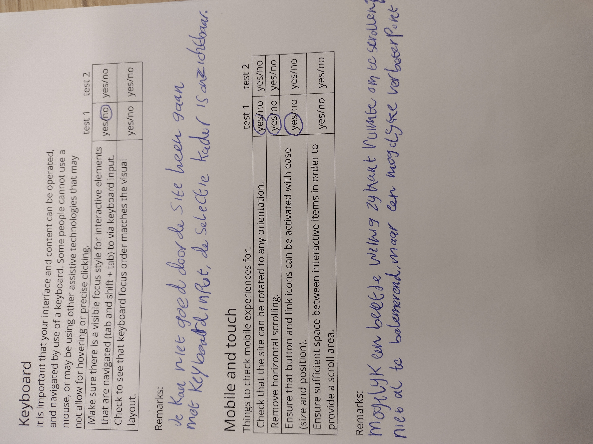
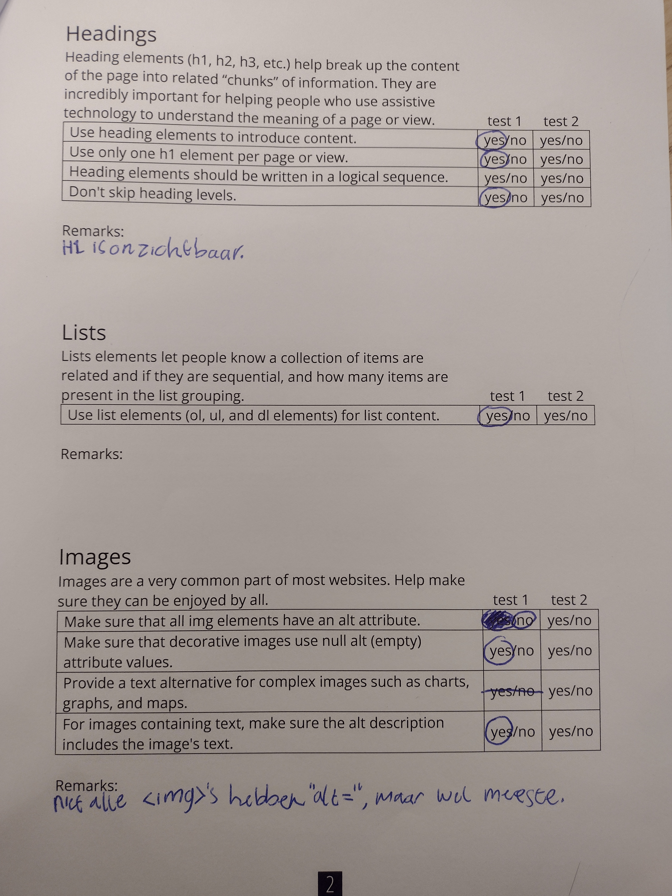
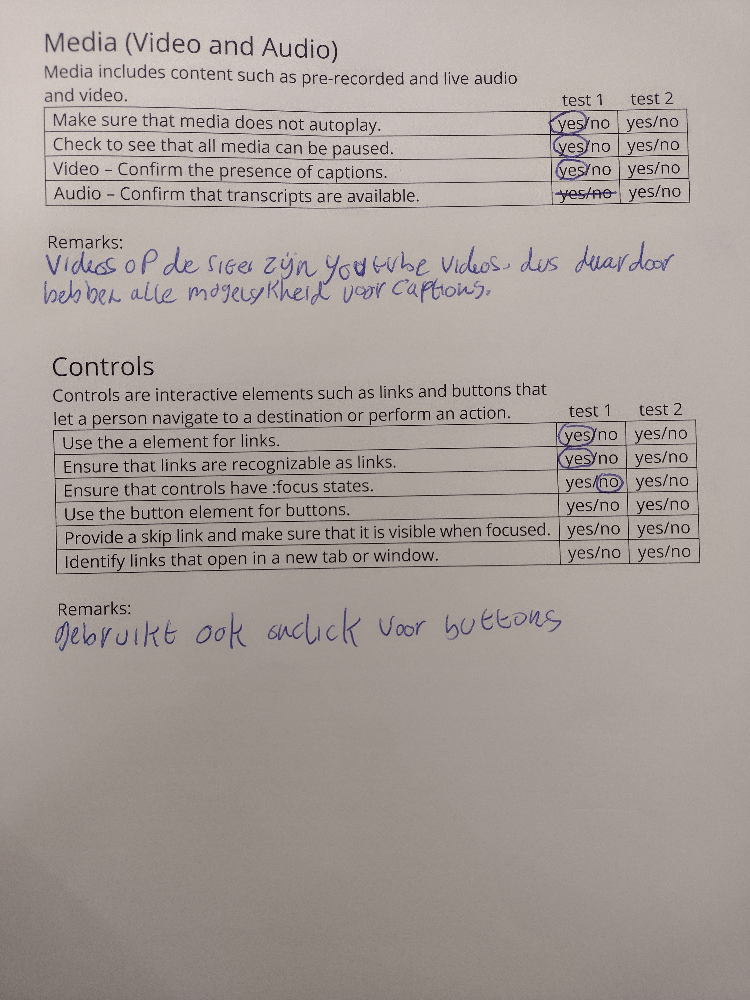
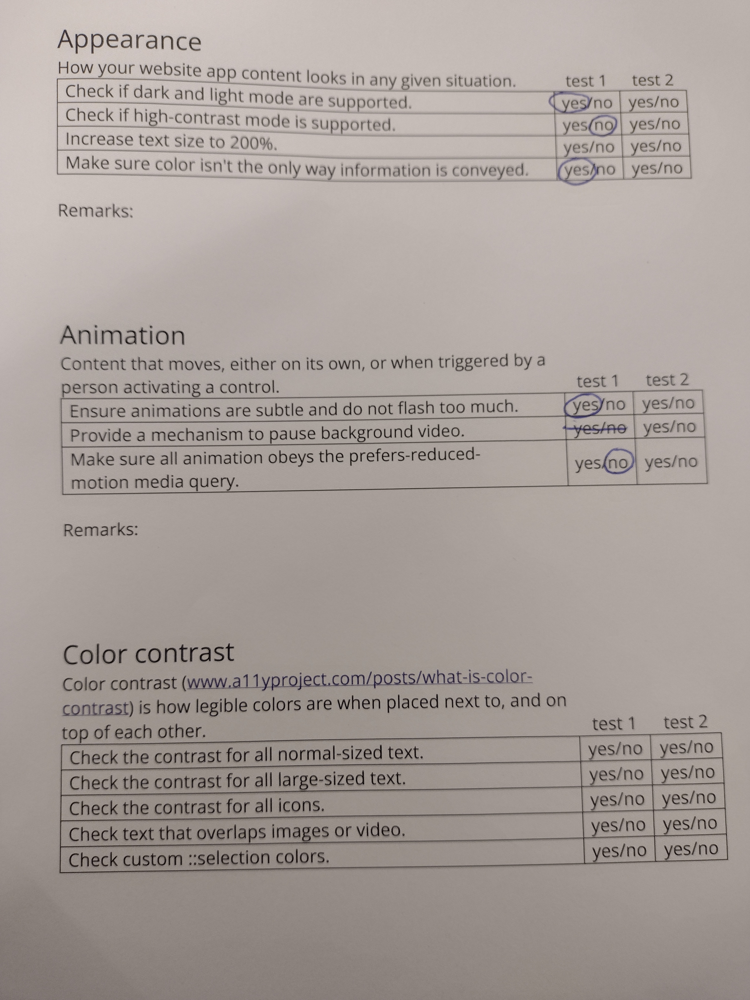
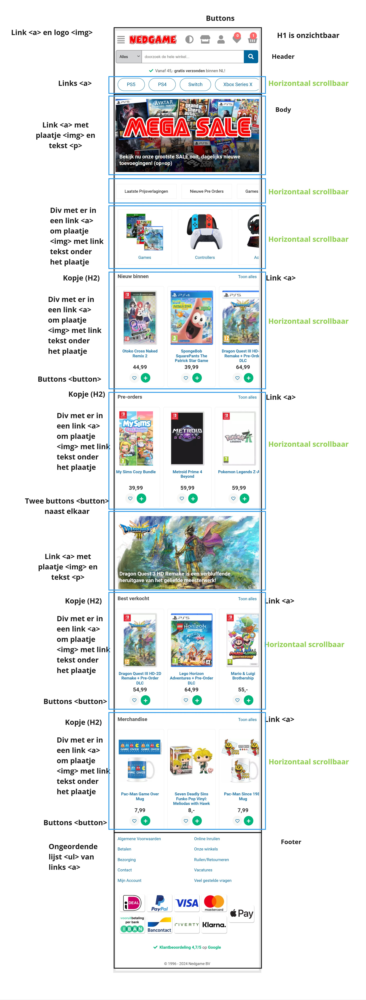
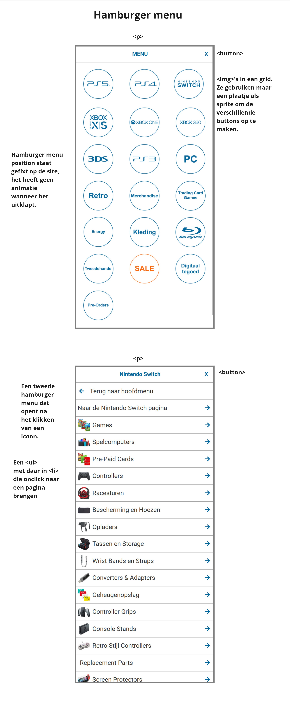

# Procesverslag
Markdown is een simpele manier om HTML te schrijven.  
Markdown cheat cheet: [Hulp bij het schrijven van Markdown](https://github.com/adam-p/markdown-here/wiki/Markdown-Cheatsheet).

Nb. De standaardstructuur en de spartaanse opmaak van de README.md zijn helemaal prima. Het gaat om de inhoud van je procesverslag. Besteedt de tijd voor pracht en praal aan je website.

Nb. Door *open* toe te voegen aan een *details* element kun je deze standaard open zetten. Fijn om dat steeds voor de relevante stuk(ken) te doen.

## Jij

  
uitwerken voor kick-off werkgroep

  ### Auteur:
  Sander Wacanno

  #### Je startniveau:
  Rood?

  #### Je focus:
  Responsive
 

## Je website

  
uitwerken voor kick-off werkgroep

  ### Je opdracht:
  De site die ik ga namaken voor deze opdracht is de site van Nedgame, een Nederlandse video game en merchandise verkoper. Ik bezoek de webshop vaak om te kijken wat ze aan het verkopen zijn.
  https://www.nedgame.nl/

  Link naar de Github live page:
  https://sanderwacanno.github.io/FrontEndDevelopment/

  #### Screenshot(s) van de eerste pagina (small screen): 
  Home pagina
  

  #### Screenshot(s) van de tweede pagina (small screen):
  Merchandise pagina
  
 

## Toegankelijkheidstest 1/2 (week 1)

  
uitwerken na test in 2e werkgroep

  
  
  
  
  
  

  ### Bevindingen
  Lijst met je bevindingen die in de test naar voren kwamen:
  - Site code lijkt wel redelijk te kloppen, maar het gebruikt veel div'jes (tot het punt waar het een beetje slordig lijkt) waar mogelijk inplaats sections hadden kunnen gebruikt worden.
  - Je kan niet door de site heen met keyboard, omdat de selectie kader onzichtbaar is.

## Breakdownschets (week 1)

  
uitwerken na afloop 3e werkgroep

  ### de hele pagina: 
  

  ### dynamisch deel (bijv menu): 
  

  <!-- ### wellicht nog een dynamisch deel (bijv filter): 
   -->

## Voortgang 1 (week 2)

  
uitwerken voor 1e voortgang

  ### Stand van zaken
  hier dit ging goed & dit was lastig (neem ook screenshots op van delen van je website en code)

  ### Agenda voor meeting
  samen met je groepje opstellen

  | Sander      | Esmee         | Tom    | Xavannah        |
  | ---            | ---                | ---          | ---              |
  | Images        | Menu's             | Navigatie    | en dan ik dat    |
  | Image Sprites | footer's | contentfoto's  | dit wil ik zeker |
  | Het weghalen van content gebasseerd op schermgrootte            | Videos               | Animatie/gif          | ...              |

  ### Verslag van meeting
  hier na afloop snel de uitkomsten van de meeting vastleggen

 - Twee puntjes voor elke image ../images

- Geef buttons aria-label

- prijs in < p >

- zet plaatje en naam in < a > 

- href="#" voor loze links

- Twee verschillende navbars

## Voortgang 2 (week 3)

  
uitwerken voor 2e voortgang

  ### Stand van zaken
  hier dit ging goed & dit was lastig (neem ook screenshots op van delen van je website en code)

  ### Agenda voor meeting
  samen met je groepje opstellen

  | Sander     | Esmee          | Tom    | student 4        |
  | ---            | ---                | ---          | ---              |
  | SVG's  | Slider positite          | SVGs    | en dan ik dat    |
  | Grids | Videos / form | nog een punt | dit wil ik zeker |
  | ...            | Eerste slider               | ...          | ...              |

  ### Verslag van meeting
  hier na afloop snel de uitkomsten van de meeting vastleggen

  - punt 1
  - punt 22
  - nog een punt
- ...

## Toegankelijkheidstest 2/2 (week 4)

  
uitwerken na test in 9e werkgroep

  ### Bevindingen
  Lijst met je bevindingen die in de test naar voren kwamen (geef ook aan wat er verbeterd is):

## Voortgang 3 (week 4)

  
uitwerken voor 3e voortgang

  ### Stand van zaken
  hier dit ging goed & dit was lastig (neem ook screenshots op van delen van je website en code)

  ### Agenda voor meeting
  samen met je groepje opstellen

  | student 1      | student 2          | student 3    | student 4        |
  | ---            | ---                | ---          | ---              |
  | dit bespreken  | en dit             | en ik dit    | en dan ik dat    |
  | en dat ook nog | dit als er tijd is | nog een punt | dit wil ik zeker |
  | ...            | ...                | ...          | ...              |

  ### Verslag van meeting
  hier na afloop snel de uitkomsten van de meeting vastleggen

  - punt 1
  - punt 2
  - nog een punt
  - ...

## Eindgesprek (week 5)

  
uitwerken voor eindgesprek

  ### Je uitkomst - karakteristiek screenshots:
  

  ### Dit ging goed/Heb ik geleerd: 
  Korte omschrijving met plaatjes

  

  ### Dit was lastig/Is niet gelukt:
  Korte omschrijving met plaatjes

  

## Bronnenlijst

  
continu bijhouden terwijl je werkt

  Nb. Wees specifiek ('css-tricks' als bron is bijv. niet specifiek genoeg). 
  Nb. ChatGpT en andere AI horen er ook bij.
  Nb. Vermeld de bronnen ook in je code.

  1. bron 1
  https://www.w3schools.com/css/css3_shadows_box.asp
  2. bron 2
  3. ...

